# jihan-optimize-practice.web
본 레포지토리는 웹페이지 최적화 연습을 위합니다.

# 성능 최적화 보고서 요약

- 🎛️ PageSpeed Insights에서의 평가지표를 기준으로 하여 만점을 목표로 최적화 작업을 수행함.

|항목|초기|커밋1|커밋2|커밋3|커밋4|커밋5|커밋6|커밋7|커밋8|결과|
|---|---|---|---|---|---|---|---|---|---|---|
|FCP|  7|  7|  6|  7| 10| 10| 10| 10| 10| 10|
|LCP|  0|  5|  8| 10| 20| 23| 23| 24| 23| 25|
|TBT| 10|  9|  8|  6|  7|  5| 24| 30| 30| 30|
|CLS| 25|  6| 25| 25| 25| 25| 25| 25| 25| 25|
|SI | 10| 10| 10| 10| 10| 10| 10| 10| 10| 10|
|총점|52| 37| 57| 58| 71| 73| 91| 99| 99|100|

- 평가 지표
  - FCP: First Contentful Paint	10%
  - LCP: Largest Contentful Paint	25%
  - TBT: Total Blocking Time	30%
  - CLS: Cumulative Layout Shift 25%
  - SI: Speed Index	10%

0. 초기 평가지표 확인
1. 모던 이미지 포맷 적용(jpg → webp)
2. 이미지 조건부 로딩 적용
3. 써드파티 script 태그 관리
4. 웹 폰트 로컬 임포트
5. **이미지 에셋 리사이징, picture태그 추가 및 width, height 명시**
6. 퍼스트파티 javascript 최적화
7. section 분리 (best-sellers와 all-products 분리)
8. 캐시 정책 추가
9. (+)성능 외 평가항목 관련 업데이트

### As-is

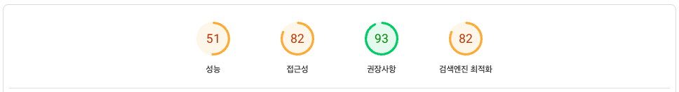

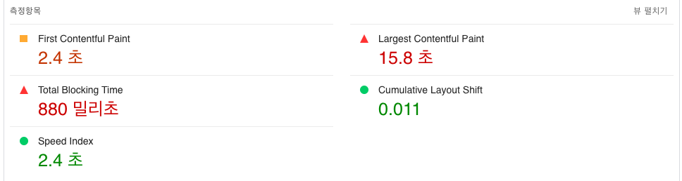

### To-be

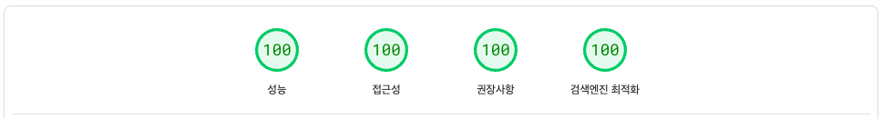

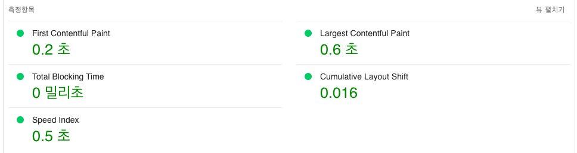

# 성능 지표 기반 성능 최적화 과정

## 0. 초기 평가지표 확인
- [💾 Github Commit Link](https://github.com/bbbjihan/jihan-optimize-practice.web/commit/f3fcf99fa0eff3acda14b6f82bf34f77ad3cfd8c)
- [🎛️ PageSpeed Insights](https://pagespeed.web.dev/analysis/https-jihan-optimize-practice-web-app/kpuevoiwv5?form_factor=mobile)

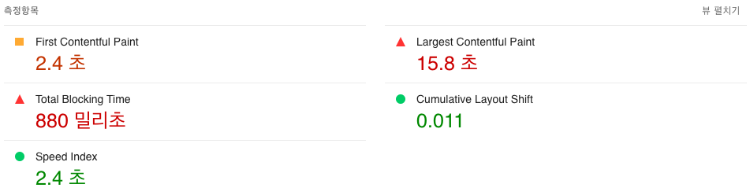

## 1. 모던 이미지 포맷 적용(jpg → webp)
- [💾 Github Commit Link](https://github.com/bbbjihan/jihan-optimize-practice.web/commit/b32afebbb605365a8035d3fc310b8362d8c6f2d5)
- [🎛️ PageSpeed Insights](https://pagespeed.web.dev/analysis/https-jihan-optimize-practice-web-app/kw9bfoxc0n?form_factor=mobile)

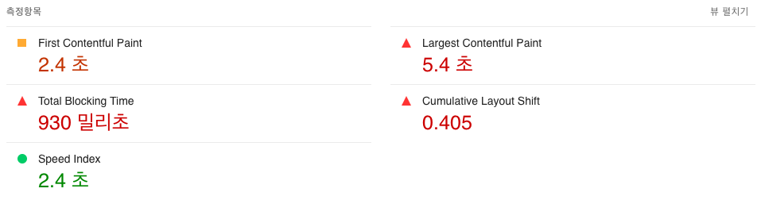

- google chrome lab에서 제공하는 이미지 포맷 변경 기능 활용
    - https://squoosh.app/
    - https://github.com/GoogleChromeLabs/squoosh

## 2. 이미지 조건부 로딩 적용
- [💾 Github Commit Link](https://github.com/bbbjihan/jihan-optimize-practice.web/commit/26e8b1bcd792cd1b50bc7acffd31d93e356b2258)
- [🎛️ PageSpeed Insights](https://pagespeed.web.dev/analysis/https-jihan-optimize-practice-web-app/7vnb7hc9vl?form_factor=mobile)

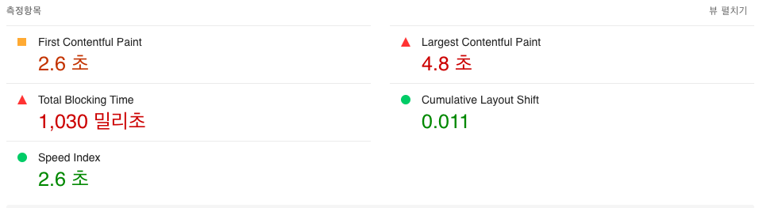

- img 태그의 srcset과 sizes 속성을 활용하여 디바이스 사이즈에 맞는 이미지만을 로드하도록 설정해주었음
- 각 image 태그에 loading=”eager”, loading=”lazy” 속성을 추가하여, 페이지 초기 진입 시의 우선순위를 태그에 명시해주었음.

### To-be: 반응형으로 렌더링되는 이미지를 초기에 전부 로드해옴

```html
...


...
```
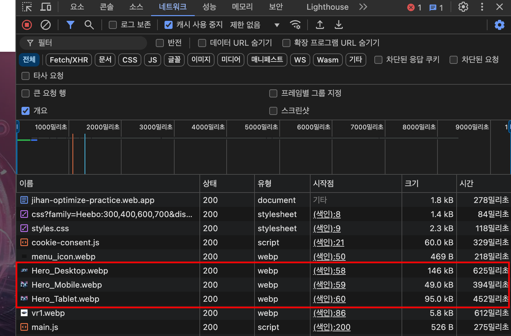

### As-is:  현재 브라우저 크기에 맞게 필요한 이미지 태그만 렌더링(소스를 로드)함

```html
...

...
```
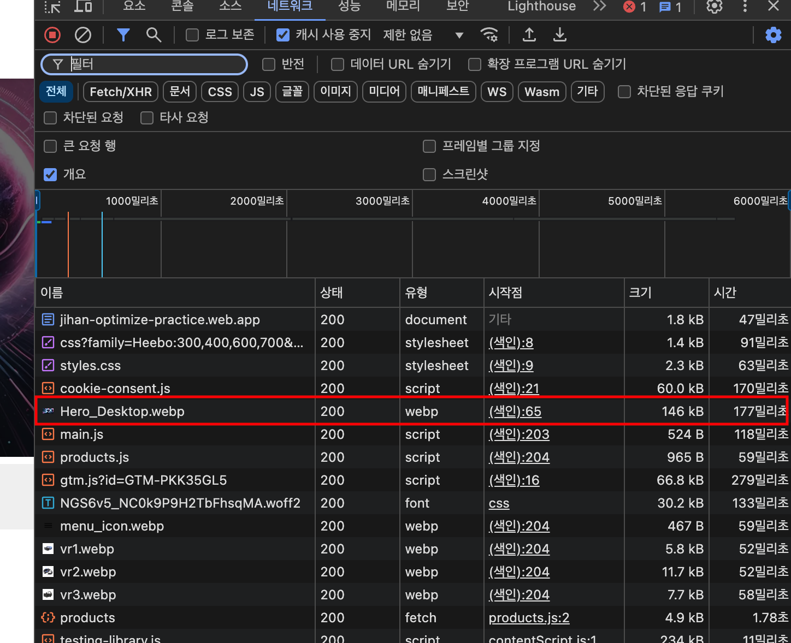

## 3. 써드파티 script 태그 관리
- [💾 Github Commit Link](https://github.com/bbbjihan/jihan-optimize-practice.web/commit/e1d483e33e44962b9e66c86f4f70dabfd46a5d44)
- [🎛️ PageSpeed Insights](https://pagespeed.web.dev/analysis/https-jihan-optimize-practice-web-app/arl2x9cfqh?form_factor=mobile)

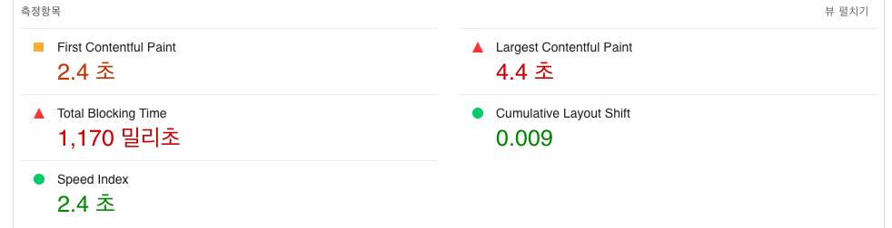

- 초기 렌더링에 영향을 주지 않는 써드파티 스크립트의 경우, defer 프로퍼티를 적용하여 낮은 우선순위로 로드되도록 하였다.
  - https://ko.javascript.info/script-async-defer
- 또한 스크립트의 로드 순서에 따라 DOM 객체가 생성되지 않아 접근하지 못할 때가 발생하여, DOMContentLoaded event listener를 활용하여 스크립트 동작 시기를 뒤로 미루어 주었다.

### As-is

```html
<!-- Google Tag Manager -->
<script>(function(w,d,s,l,i){w[l]=w[l]||[];w[l].push({'gtm.start':
    new Date().getTime(),event:'gtm.js'});var f=d.getElementsByTagName(s)[0],
    j=d.createElement(s),dl=l!='dataLayer'?'&l='+l:'';j.async=true;j.src=
    'https://www.googletagmanager.com/gtm.js?id='+i+dl;f.parentNode.insertBefore(j,f);
    })(window,document,'script','dataLayer','GTM-XXXXXXXX');
</script>
<!-- End Google Tag Manager -->

<!-- Cookie Consent by FreePrivacyPolicy.com https://www.FreePrivacyPolicy.com -->
<script type="text/javascript" src="//www.freeprivacypolicy.com/public/cookie-consent/4.1.0/cookie-consent.js" charset="UTF-8"></script>
<script type="text/javascript" charset="UTF-8">
    cookieconsent.run({"notice_banner_type":"simple","consent_type":"express","palette":"light","language":"en","page_load_consent_levels":["strictly-necessary"],"notice_banner_reject_button_hide":false,"preferences_center_close_button_hide":false,"page_refresh_confirmation_buttons":false,"website_name":"Performance Course"});
</script>
```
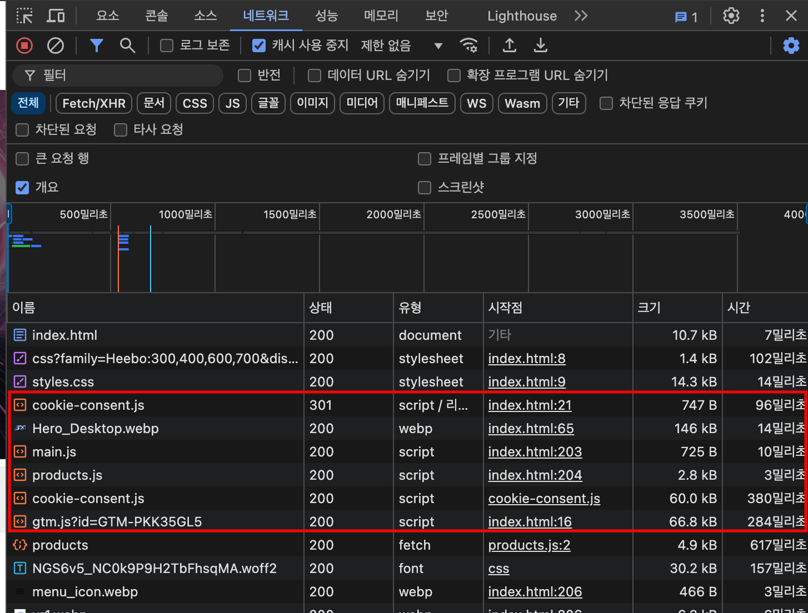

### To-be

```html
<!-- Google Tag Manager -->
<script defer>(function(w,d,s,l,i){w[l]=w[l]||[];w[l].push({'gtm.start':
    new Date().getTime(),event:'gtm.js'});var f=d.getElementsByTagName(s)[0],
    j=d.createElement(s),dl=l!='dataLayer'?'&l='+l:'';j.async=true;j.src=
    'https://www.googletagmanager.com/gtm.js?id='+i+dl;f.parentNode.insertBefore(j,f);
    })(window,document,'script','dataLayer','GTM-XXXXXXXX');
</script>
<!-- End Google Tag Manager -->

<!-- Cookie Consent by FreePrivacyPolicy.com https://www.FreePrivacyPolicy.com -->
<script defer type="text/javascript" src="//www.freeprivacypolicy.com/public/cookie-consent/4.1.0/cookie-consent.js" charset="UTF-8"></script>
<script defer type="text/javascript" charset="UTF-8">
	window.addEventListener("DOMContentLoaded",() => cookieconsent.run({"notice_banner_type":"simple","consent_type":"express","palette":"light","language":"en","page_load_consent_levels":["strictly-necessary"],"notice_banner_reject_button_hide":false,"preferences_center_close_button_hide":false,"page_refresh_confirmation_buttons":false,"website_name":"Performance Course"}))
</script>
```
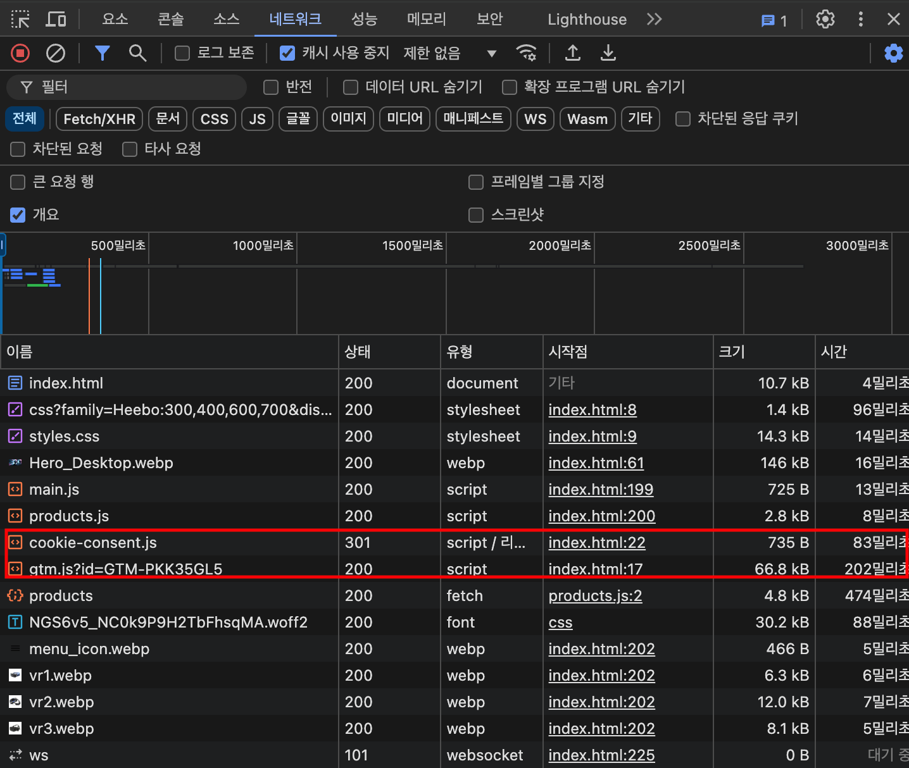

## 4. 웹 폰트 로컬 임포트
- [💾 Github Commit Link](https://github.com/bbbjihan/jihan-optimize-practice.web/commit/28ca600dc63280a052a8382eb1970a423d030030)
- [🎛️ PageSpeed Insights](https://pagespeed.web.dev/analysis/https-jihan-optimize-practice-web-app/u3qv7zm1lj?form_factor=mobile)

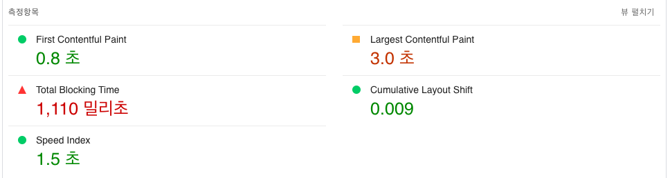

- 구글 웹 폰트로 사용하고 있는 Heebo를 다운로드 받아, woff로 변환한 뒤 css에서 직접 Import해주었다.
- HTML 코드 내부의 웹 폰트 로드 구문을 제거하여, 구글 웹 폰트 서버에서 폰트를 다운로드 받는 패킷을 제거하였다.

```css
@font-face {
  font-family: 'Heebo';
  src: url('/css/fonts/Heebo-300.woff') format('woff');
  font-weight: 300;
}

@font-face {
  font-family: 'Heebo';
  src: url('/css/fonts/Heebo-400.woff') format('woff');
  font-weight: 400;
}

@font-face {
  font-family: 'Heebo';
  src: url('/css/fonts/Heebo-600.woff') format('woff');
  font-weight: 600;
}

@font-face {
  font-family: 'Heebo';
  src: url('/css/fonts/Heebo-700.woff') format('woff');
  font-weight: 700;
}
```

### To-be


### As-is

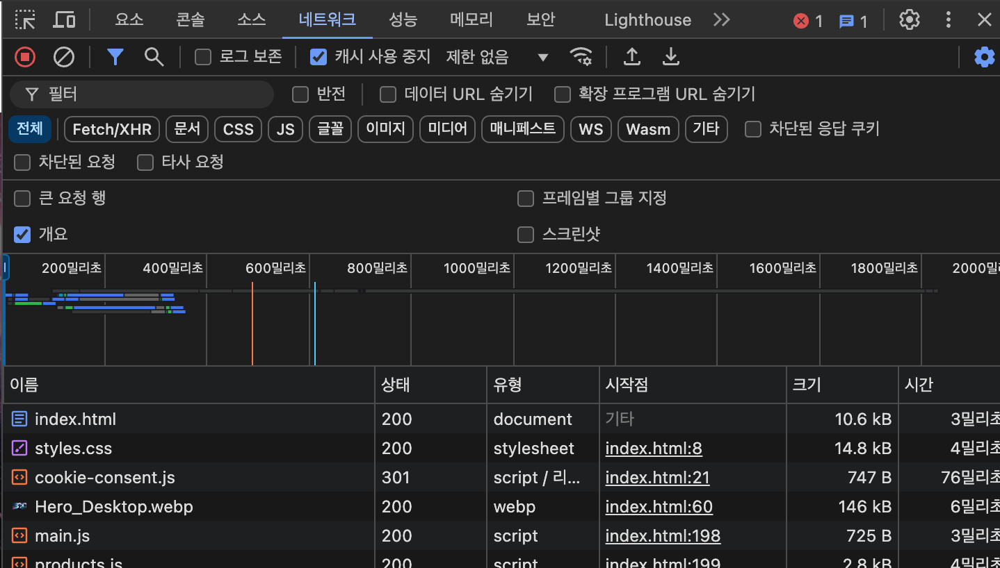

## 5. **이미지 에셋 리사이징, picture태그 추가 및 width, height 명시**
- [💾 Github Commit Link](https://github.com/bbbjihan/jihan-optimize-practice.web/commit/ca19d038ab246137148e4b8fa29eb61366f529f1)
- [🎛️ PageSpeed Insights](https://pagespeed.web.dev/analysis/https-jihan-optimize-practice-web-app/klvzh8vtxy?form_factor=mobile)

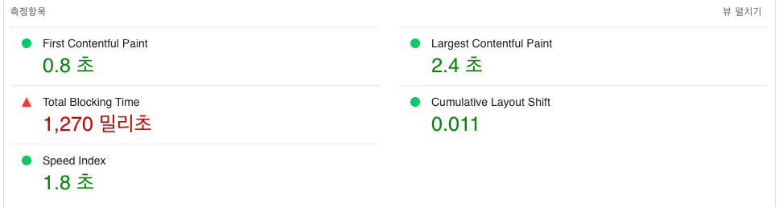

- 이미지 태그 내에 width, height이 명시되어 있지 않은 경우를 없애고 css로 리사이즈를 해주면서, 초기 렌더링 크기를 명시해주었다.
- 초기 렌더링 크기에 맞게 이미지 에셋들을 리사이징하고 새로 압축해주었다.

## 6. 퍼스트파티 javascript 최적화
- [💾 Github Commit Link](https://github.com/bbbjihan/jihan-optimize-practice.web/commit/ca9ea224bed2f6f3096b06b57233e4bdf3da24cc)
- [🎛️ PageSpeed Insights](https://pagespeed.web.dev/analysis/https-jihan-optimize-practice-web-app/1v9ofbpue3?form_factor=mobile)

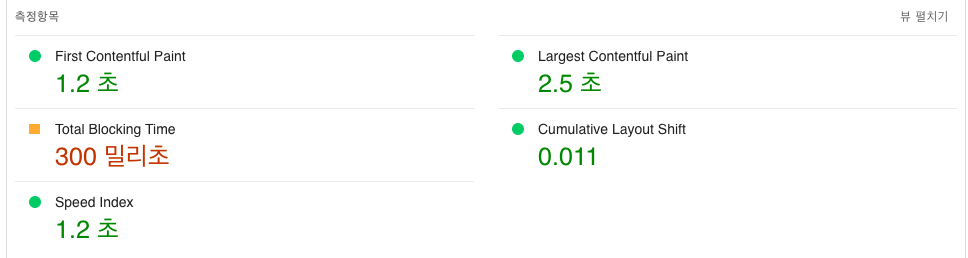

- product.js에 렌더링 병목을 위해 인위적으로 작성된 무거운 연산 부분을 수정하였다.
- 렌더링이 완료된 이후의 스크롤을 통해 최초 1회 product load의 동작 이후에 호출되도록 수정하였다.

```jsx
function heavyFunction() {
  // Simulate heavy operation. It could be a complex price calculation.
  for (let i = 0; i < 10000000; i++) {
    const temp = Math.sqrt(i) * Math.sqrt(i);
  }
}

let loaded = false;

window.onload = () => {
  window.onscroll = () => {
    if (loaded) return;

    const status = "idle";
    const $productSection = document.querySelector("#all-products");
    const position =
      $productSection.getBoundingClientRect().top -
      (window.scrollY + window.innerHeight);

    if (status == "idle" && position <= 0) {
      loaded = true;
      loadProducts().finally(heavyFunction);
    }
  };
};
```

## 7. section 분리 (best-sellers와 all-products 분리)
- [💾 Github Commit Link](https://github.com/bbbjihan/jihan-optimize-practice.web/commit/53ac70c490458dbd20c3c0047c459eaee239bdc7)
- [🎛️ PageSpeed Insights](https://pagespeed.web.dev/analysis/https-jihan-optimize-practice-web-app/rrjh9ah03f?form_factor=mobile)

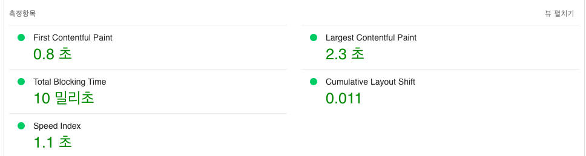

- 퍼스트 파티 이미지에 대해서 width와 height을 img 태그에 명시하고, aspect ratio를 유지하려고 하였으나 퍼스트 파티 이미지가 사용되는 best sellers section과 써드 파티 이미지가 사용되는 all products section이 코드상 분리되어있지 않다는 것을 확인함.
- HTML의 section class를 분리해주고, css에서 best-sellers 섹션에 대해 적용되던 내용을 all-products에도 적용되도록 수정한 뒤, img 태그에 대해서만 분리해주었음.

## 8. 캐시 정책 추가
- [💾 Github Commit Link](https://github.com/bbbjihan/jihan-optimize-practice.web/commit/fb40effd23dcc59a0da6dfea05bb005e0811b0b1)
- [🎛️ PageSpeed Insights](https://pagespeed.web.dev/analysis/https-jihan-optimize-practice-web-app/ox1w5vipl4?form_factor=mobile)

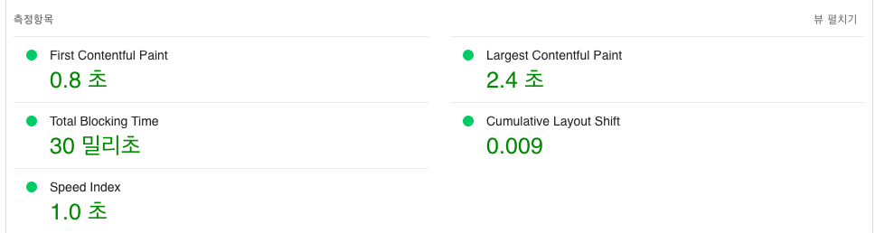

- “효율적인 캐시 정책을 사용하여 정적인 애셋 제공하기” 항목을 위함
- 프로젝트 환경인 firebase hosting에서는 CDN을 따로 설정하지 않아도 지원하기 때문에 캐시 정책만 설정해주면 됨.
- HTTP response의 Header에 Cache-Control을 31536000으로 지정해주어서 재접속시 메모리 캐시가 적용되도록 firebase.json에 명시해줌
- https://firebase.google.com/docs/hosting/manage-cache?hl=ko
- https://firebase.google.com/docs/hosting/full-config?hl=ko#headers

```json
// ./firebase.json
{
  "hosting": {
    "public": "/",
    "ignore": ["firebase.json", "**/.*", "**/node_modules/**"],
    "headers": [
      {
        "source": "**/*.@(js|css|jpg|jpeg|gif|png|webp|ttf|woff|woff2)",
        "headers": [
          {
            "key": "Cache-Control",
            "value": "public, max-age=31536000"
          }
        ]
      }
    ]
  }
}
```
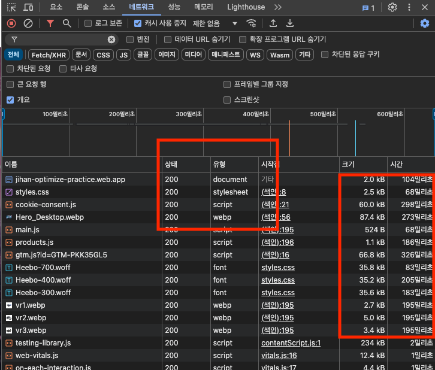
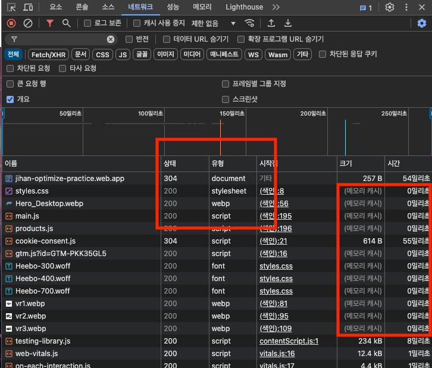

## + 성능 외 평가항목 관련 업데이트
- [💾 Github Commit Link](https://github.com/bbbjihan/jihan-optimize-practice.web/commit/16615cf94e3f80bc2898aa06d1d02ef6b81c4779)
- [🎛️ PageSpeed Insights](https://pagespeed.web.dev/analysis/https-jihan-optimize-practice-web-app/b3m9llufxm?form_factor=mobile)

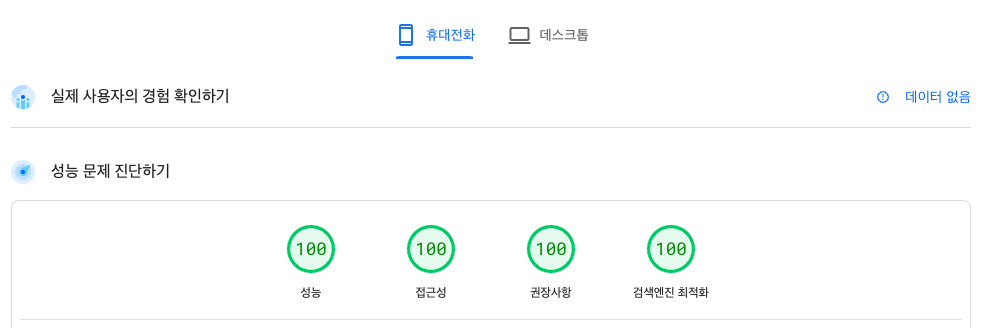

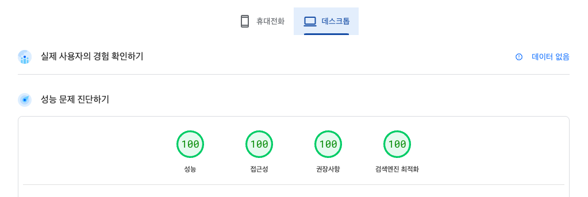

- robots.txt 추가
- header 시맨틱 태그 내림차순 작성
- 배경색 대비율 조정
  - https://dequeuniversity.com/rules/axe/4.9/color-contrast
- 퍼스트파티 애셋 CORS 해제
- img 태그 alt 프로퍼티 추가
- google tag manager disable
- head에 meta description 추가